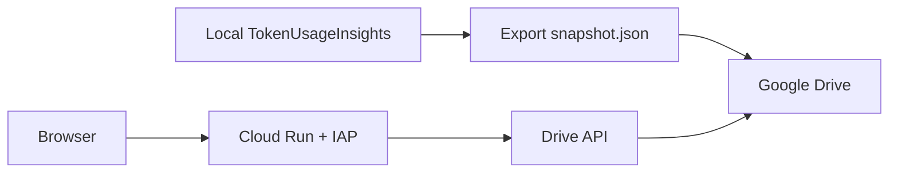

# Cloud Run 讀 Google Drive Snapshot

這個模式讓 Cloud Run 只提供唯讀看板，資料不放 GCS、不連本機 SQLite。資料來源是本機定期匯出的 `snapshot.json`，再透過 Google Drive 分享給 Cloud Run 的 service account 讀取。

## 架構



## Snapshot 內容

Snapshot 預先產生前端看板需要的每日、每月、每年 API response：

- `dates`, `months`, `years`
- `usage/:date`
- `monthly/:year_month`
- `yearly/:year`

Cloud Run snapshot 模式不包含本機 transcript timeline。`raw_entries.transcript_path` 也會被清空，避免把本機日誌路徑放到雲端。

涵蓋的助理：antigravity、copilot、codex、claude、cursor、grok、pi、omp、muse（`src/snapshot.rs` 的 `ASSISTANTS`，由測試釘住必須與 `handlers::is_supported_assistant` 一致）。`--export-snapshot` 直接呼叫本機看板的 handler 產生 response，內容與本機 API 完全一致。

`--export-snapshot <path>` 必須是第一個參數（不可與 `export`／`import`／`update` 等子命令混用）；`TOKEN_USAGE_INSIGHTS_EXPORT_SNAPSHOT` 環境變數只在不帶任何參數執行時生效。匯出會先增量同步本機日誌，但不做舊版資料庫遷移（由看板啟動時處理）。每日回應包含 `home_dir` 與各 session 的 `cwd`、`session_name`（前端用來分組與縮寫路徑），只有 `transcript_path` 會被清空。

Snapshot 模式唯讀，以下功能回 `501` JSON 錯誤：Session 提示詞搜尋、模型 Session 明細、單日匯出／匯入、匯入批次查詢與回滾。

## 與 upstream 自動更新的關係（v0.9.8 起）

upstream v0.9.8 起看板預設會自動更新，下載來源固定是 `doggy8088/TokenUsageInsights` 的官方 Release（不含本 fork 的 snapshot 功能）。

- Cloud Run：snapshot 模式在啟動時就跳過更新流程，`Dockerfile` 另設 `TOKEN_USAGE_INSIGHTS_AUTO_UPDATE=0` 作為雙重保險。
- 本機：若把本 fork 建置的執行檔安裝到 `%LOCALAPPDATA%\TokenUsageInsights`（upstream 判定為「標準安裝」的位置），自動更新會把它換成官方版，`--export-snapshot` 隨之消失。請在啟動看板的環境設 `TOKEN_USAGE_INSIGHTS_AUTO_UPDATE=0`，或啟動時加 `--no-auto-update`。

## 本機匯出

```powershell
pwsh -ExecutionPolicy Bypass -File .\scripts\export-snapshot.ps1 `
  -OutputPath "G:\My Drive\TokenUsageInsights\snapshot.json" `
  -ExePath ".\target\release\token-usage-insights.exe"
```

也可以直接用執行檔：

```powershell
.\token-usage-insights.exe --export-snapshot "G:\My Drive\TokenUsageInsights\snapshot.json"
```

建議用 Windows Task Scheduler 每 15 到 60 分鐘跑一次。頻率越高，Drive API 與 Cloud Run 讀取壓力越高；個人看板通常 30 分鐘已足夠。

## 自動上傳到 Google Drive

如果不使用 Google Drive 桌面同步程式，可以改用 `gcloud` 的 Application Default Credentials 取得 `chris@berlin.com.tw` 的 OAuth token，再由腳本直接呼叫 Drive API。

首次使用先登入 ADC，scope 使用 `drive.file`，讓腳本只管理它建立或開啟過的檔案：

```powershell
gcloud --account=chris@berlin.com.tw auth application-default login `
  --scopes=https://www.googleapis.com/auth/drive.file,https://www.googleapis.com/auth/cloud-platform `
  --project=tokenusage-chris-20260709
```

上傳並分享給 Cloud Run service account：

```powershell
pwsh -ExecutionPolicy Bypass -File .\scripts\upload-drive-snapshot.ps1 `
  -GcloudAccount chris@berlin.com.tw `
  -ProjectId tokenusage-chris-20260709 `
  -ShareWithServiceAccount token-insights-drive@demoproject-dotnet.iam.gserviceaccount.com
```

腳本會把 Drive file ID 存在 `%LOCALAPPDATA%\TokenUsageInsights\drive-snapshot-file-id.txt`。之後排程重跑會更新同一個檔案，而不是每次建立新檔。
Session timeline 事件會另外上傳成獨立 JSON 檔，並記錄在 `%LOCALAPPDATA%\TokenUsageInsights\drive-session-events-index.json`。預設只重新檢查最近 2 天的 session events，以避免每次排程都重抓並重設所有舊 session 的 Drive 權限；若需要完整重刷，執行時加上 `-RefreshAllSessionEvents`。

若某個 assistant 有大量從未上傳的 session（例如 copilot 的歷史積壓），會讓整個 run 因逐筆上傳而超時、連核心 snapshot 都上傳不了。此時可用 `-SkipSessionEventAssistants` 跳過該 assistant 的 session event 上傳（其每日／每月／每年核心資料仍照常匯出）：

```powershell
pwsh -ExecutionPolicy Bypass -File .\scripts\upload-drive-snapshot.ps1 `
  -ExportFromApi -ApiUrl http://localhost:3003 `
  -SkipSessionEventAssistants copilot
```

注意：目前 session event index 只在整個 run 成功結束時才存檔，因此積壓過大導致 run 無法完成時，已上傳的進度不會被記住。要讓大量積壓能跨多次排程逐步補完，需改為「增量存檔（checkpoint）」。

若本機已安裝的 `token-usage-insights.exe` 還不是支援 `--export-snapshot` 的版本，腳本會自動改從正在執行的本機看板 API 匯出。預設 API 是 `http://localhost:3003`，也可以明確指定：

```powershell
pwsh -ExecutionPolicy Bypass -File .\scripts\upload-drive-snapshot.ps1 `
  -ExportFromApi `
  -ApiUrl http://localhost:3003
```

若已經有現成 snapshot 檔案，可以略過匯出直接上傳：

```powershell
pwsh -ExecutionPolicy Bypass -File .\scripts\upload-drive-snapshot.ps1 `
  -SkipExport `
  -SnapshotPath "C:\path\to\snapshot.json"
```

本機已設定的排程名稱：

```text
TokenUsageInsights Drive Snapshot Upload
```

目前排程每 30 分鐘執行一次，從 `http://localhost:3003` 匯出 snapshot 後上傳 Drive。因此本機看板服務需要在排程執行時可連線。

## Google Drive 權限

1. 建立或選用 Cloud Run service account，例如：

```bash
gcloud iam service-accounts create token-insights-run \
  --display-name="Token Usage Insights Cloud Run"
```

2. 把 `snapshot.json` 或所在 Drive 資料夾分享給 service account email，權限給 Viewer。
3. 在 GCP project 啟用 Google Drive API。

Service account email 會像：

```text
token-insights-run@PROJECT_ID.iam.gserviceaccount.com
```

## 部署到 Cloud Run

以下以 `asia-east1` 為例，請依你的 GCP project 調整。

```bash
gcloud services enable run.googleapis.com artifactregistry.googleapis.com drive.googleapis.com iap.googleapis.com

gcloud run deploy token-usage-insights \
  --source . \
  --region asia-east1 \
  --service-account token-insights-run@PROJECT_ID.iam.gserviceaccount.com \
  --no-allow-unauthenticated \
  --iap \
  --set-env-vars TOKEN_USAGE_INSIGHTS_DATA_SOURCE=snapshot,DRIVE_SNAPSHOT_FILE_ID=DRIVE_FILE_ID,DRIVE_TOKEN_SCOPE=https://www.googleapis.com/auth/drive.readonly,TOKEN_USAGE_INSIGHTS_SNAPSHOT_REFRESH_SECONDS=300
```

部署完成後，只授權指定使用者讀取：

```bash
gcloud iap web add-iam-policy-binding \
  --member=user:chris@berlin.com.tw \
  --role=roles/iap.httpsResourceAccessor \
  --region=asia-east1 \
  --resource-type=cloud-run \
  --service=token-usage-insights
```

## 成本控制

- Cloud Run 設定 `min-instances=0`，閒置時縮到 0。
- Artifact Registry 只保留最近 1 到 2 個 image。
- 不開 Artifact Registry vulnerability scanning，避免掃描費。
- 設 Billing budget alert，例如 1 USD 與 5 USD。
- 若只給自己看，`TOKEN_USAGE_INSIGHTS_SNAPSHOT_REFRESH_SECONDS=300` 或更高即可。

## 本機測 snapshot 模式

```powershell
$env:TOKEN_USAGE_INSIGHTS_DATA_SOURCE = "snapshot"
$env:TOKEN_USAGE_INSIGHTS_SNAPSHOT_PATH = "G:\My Drive\TokenUsageInsights\snapshot.json"
$env:PORT = "3004"
.\token-usage-insights.exe
```

開啟：

```text
http://localhost:3004/?agent=claude&tab=monthly&date=2026-07
```
