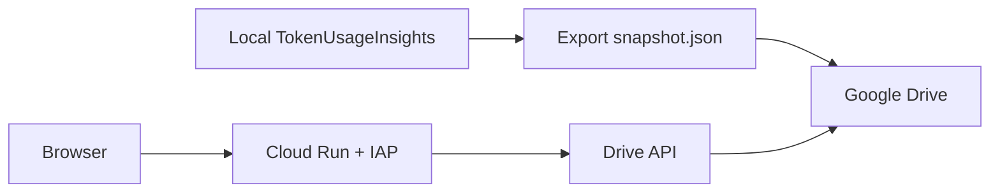

# Cloud Run 讀 Google Drive Snapshot

這個模式讓 Cloud Run 只提供唯讀看板，資料不放 GCS、不連本機 SQLite。資料來源是本機定期匯出的 `snapshot.json`，再透過 Google Drive 分享給 Cloud Run 的 service account 讀取。

## 架構



## Snapshot 內容

Snapshot 預先產生前端看板需要的每日、每月、每年 API response：

- `dates`, `months`, `years`
- `usage/:date`
- `monthly/:year_month`
- `yearly/:year`

Cloud Run snapshot 模式不包含本機 transcript timeline。`raw_entries.transcript_path` 也會被清空，避免把本機日誌路徑放到雲端。

## 本機匯出

```powershell
pwsh -ExecutionPolicy Bypass -File .\scripts\export-snapshot.ps1 `
  -OutputPath "G:\My Drive\TokenUsageInsights\snapshot.json" `
  -ExePath ".\target\release\token-usage-insights.exe"
```

也可以直接用執行檔：

```powershell
.\token-usage-insights.exe --export-snapshot "G:\My Drive\TokenUsageInsights\snapshot.json"
```

建議用 Windows Task Scheduler 每 15 到 60 分鐘跑一次。頻率越高，Drive API 與 Cloud Run 讀取壓力越高；個人看板通常 30 分鐘已足夠。

## Google Drive 權限

1. 建立或選用 Cloud Run service account，例如：

```bash
gcloud iam service-accounts create token-insights-run \
  --display-name="Token Usage Insights Cloud Run"
```

2. 把 `snapshot.json` 或所在 Drive 資料夾分享給 service account email，權限給 Viewer。
3. 在 GCP project 啟用 Google Drive API。

Service account email 會像：

```text
token-insights-run@PROJECT_ID.iam.gserviceaccount.com
```

## 部署到 Cloud Run

以下以 `asia-east1` 為例，請依你的 GCP project 調整。

```bash
gcloud services enable run.googleapis.com artifactregistry.googleapis.com drive.googleapis.com iap.googleapis.com

gcloud run deploy token-usage-insights \
  --source . \
  --region asia-east1 \
  --service-account token-insights-run@PROJECT_ID.iam.gserviceaccount.com \
  --no-allow-unauthenticated \
  --iap \
  --set-env-vars TOKEN_USAGE_INSIGHTS_DATA_SOURCE=snapshot,DRIVE_SNAPSHOT_FILE_ID=DRIVE_FILE_ID,DRIVE_TOKEN_SCOPE=https://www.googleapis.com/auth/drive.readonly,TOKEN_USAGE_INSIGHTS_SNAPSHOT_REFRESH_SECONDS=300
```

部署完成後，只授權指定使用者讀取：

```bash
gcloud iap web add-iam-policy-binding \
  --member=user:chris@berlin.com.tw \
  --role=roles/iap.httpsResourceAccessor \
  --region=asia-east1 \
  --resource-type=cloud-run \
  --service=token-usage-insights
```

## 成本控制

- Cloud Run 設定 `min-instances=0`，閒置時縮到 0。
- Artifact Registry 只保留最近 1 到 2 個 image。
- 不開 Artifact Registry vulnerability scanning，避免掃描費。
- 設 Billing budget alert，例如 1 USD 與 5 USD。
- 若只給自己看，`TOKEN_USAGE_INSIGHTS_SNAPSHOT_REFRESH_SECONDS=300` 或更高即可。

## 本機測 snapshot 模式

```powershell
$env:TOKEN_USAGE_INSIGHTS_DATA_SOURCE = "snapshot"
$env:TOKEN_USAGE_INSIGHTS_SNAPSHOT_PATH = "G:\My Drive\TokenUsageInsights\snapshot.json"
$env:PORT = "3004"
.\token-usage-insights.exe
```

開啟：

```text
http://localhost:3004/?agent=claude&tab=monthly&date=2026-07
```
